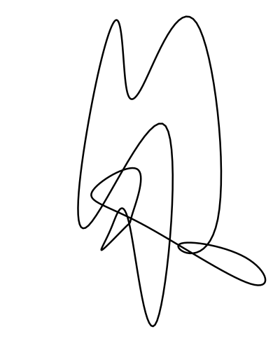

# chaosbox

`chaosbox` is a Haskell framework for generative art.

The goal of this project is to provide a solid base for building 2d generative
artwork. Let's look at a simple example of what it can do. We'll build
out a generator for a simple curve that looks something like this:



```hs
import           ChaosBox

import           Control.Monad (replicateM)
import           Data.Foldable (for_)

-- 'runChaosBoxIOWith' provides a CLI shim for the underlying render function.
-- Often it makes sense to specify a static user-space width and height
-- ('optWidth', 'optHeight') here, but these are fully configurable from the
-- command line program if you prefer.
-- 
-- Assuming this file is compiled to an executable named @chaosbox-example@, it
-- can be run like so:
--
-- > chaosbox-example --scale=100
--
-- to produce a 800x1000 version of this artwork, which is a good starting
-- size.
--
main :: IO ()
main = runChaosBoxIOWith (\opts -> opts { optWidth = 8, optHeight = 10 })
                         renderSketch

-- This is our main rendering function. The type 'Generate ()' says this is an
-- action that can perform pseudo-random generation, write to a Cairo canvas
-- and the file system (to save the Cairo canvas as a png).
--
renderSketch :: Generate ()
renderSketch = do
  -- Perform some initial parameter setting at the cairo level.
  setup
  
  -- Grab the user-space size of the canvas (width, height) and the center
  -- coordinate.
  (w, h)     <- getSize
  center     <- getCenterPoint

  -- Generate 20 points normally distributed around the center with standard
  -- deviation = w/4 in the x direction and standard deviation = h/4 in the y
  -- direction.
  randomPath <- replicateM 20 $ normal center $ V2 (w / 4) (h / 4)

  -- The points in -- 'randomPath' are used as control points in a cyclic cubic
  -- B-Spline ('ClosedCurve') which is traced in black.
  cairo $ for_ (closedCurve randomPath) $ \p -> draw p *> stroke

-- Some basic setup logic
setup :: Generate ()
setup = do
  cairo $ do
    -- Line width is in user-space, so this will be about 0.05*100 = 5px wide
    -- in the final image.
    setLineWidth 0.05
    setLineJoin LineJoinRound
    setLineCap LineCapRound

  -- Filling the whole screen requires knowledge of the width and height of the
  -- canvas, which  stored in the 'Generate' context.
  fillScreenRGB white

  -- Set the source color to black (you can think of this like a paint bucket;
  -- anything stroked or filled after this point will use this source if/until
  -- it is set to a different value)
  cairo $ setSourceRGB black
```

There is a lot more to ChaosBox than this simple functionality; I intend to
expand on this with more examples and a full tutorial in the future, but this
should get you started!
